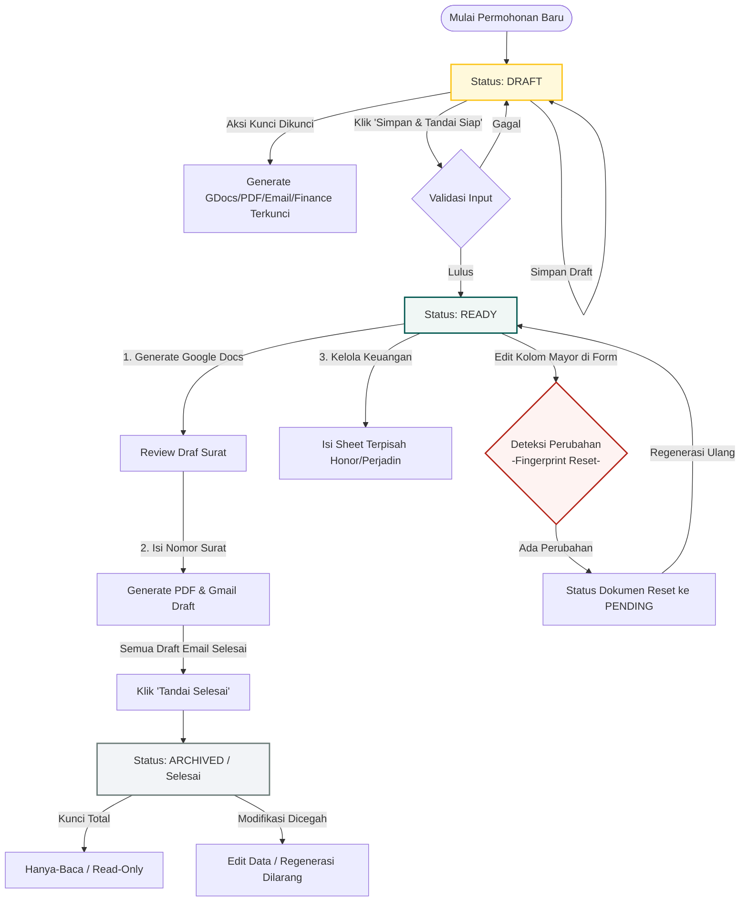

# Sistem Administrasi & Dasbor Surat DPSP

Sistem ini digunakan untuk mengelola permohonan surat tugas, rekomendasi, perizinan, narasumber, serta honorarium dan perjalanan dinas (perjadin) di lingkungan Direktorat Perencanaan Strategis dan Pemasaran (DPSP). Aplikasi ini dibangun menggunakan Google Apps Script (GAS) dengan antarmuka web modern yang terintegrasi langsung dengan spreadsheet sebagai basis data utama.

---

## 📋 Status Permohonan & Indikator Siklus Hidup

Setiap permohonan surat melewati 3 status utama. Di antarmuka, status permohonan ini selalu ditampilkan terpisah dari progres dokumen agar operator bisa membedakan lifecycle permohonan dengan hasil generate dokumen/email.

### 1. Draft (`DRAFT`)

* **Warna Badge:** 🟡 **Kuning / Oranye** (`.status-draft`)
* **Pesan Sistem:** *"Data masih dapat diubah. Lengkapi lalu tandai Siap Diproses sebelum membuat dokumen."*
* **Kondisi Data:** Permohonan baru dibuat atau belum divalidasi.
* **Perilaku Pengeditan:** Data bebas diubah sewaktu-waktu. Fitur pembuatan dokumen Google Docs, PDF, dan draft email masih dikunci.

### 2. Siap Diproses (`READY`)

* **Warna Badge:** 🟢 **Hijau** (`.status-ready`)
* **Pesan Sistem:**
  * Sebelum dokumen siap: *"Data sudah tervalidasi dan siap dibuat menjadi Doc, PDF, serta draft Gmail."*
  * Setelah dokumen siap: *"Seluruh Doc, PDF, dan draft Gmail tersedia. Permohonan dapat ditandai selesai."*
* **Kondisi Data:** Data permohonan telah tervalidasi dan memenuhi kelengkapan minimum.
* **Perilaku Pengeditan:**
  * **Dapat diubah:** Data tetap dapat diedit oleh pengguna.
  * **Reset Penginstalan (*Fingerprint Reset*):** Jika Anda mengedit kolom penting (seperti jadwal kegiatan, detail mitra, tipe kegiatan, data pegawai/narasumber, dll.), sistem akan mendeteksi perubahan tersebut. Status dokumen yang telah dibuat akan di-reset kembali menjadi `PENDING` dan file sebelumnya ditandai sebagai *superseded* (usang) agar di-generate ulang dengan data terbaru.

### 3. Selesai (`ARCHIVED`)

* **Warna Badge:** ⚪ **Abu-abu** (`.status-archived`)
* **Pesan Sistem:** *"Permohonan telah selesai dan bersifat hanya-baca."*
* **Kondisi Data:** Permohonan ditutup manual setelah seluruh draft email tersedia dan seluruh aksi lanjutan sudah final.
* **Perilaku Pengeditan:** **Terkunci Total (*Locked / Read-Only*)**. Data tidak bisa diubah baik dari sisi form dasbor maupun dimodifikasi langsung lewat backend API.
* **Tampilan Tombol Dinamis:** Ketika dokumen/PDF belum dibuat, tombol aksi yang tampil adalah **Buat Google Docs** dan **Buat PDF**. Setelah dokumen tersebut sukses di-generate, tombol akan berubah secara otomatis menjadi tautan langsung **Buka Google Docs** dan **Buka PDF**, menghilangkan tombol pembuat agar antarmuka tetap bersih dan intuitif.

### Indikator Progres Dokumen (Turunan)

Indikator ini bukan status lifecycle permohonan. Badge ini diturunkan dari hasil generate dokumen per permohonan dan ditampilkan berdampingan dengan status permohonan.

* **Belum Dibuat:** Dokumen, PDF, dan draft email belum tersedia.
* **Doc & PDF Dibuat:** Google Doc dan PDF sudah dibuat, tetapi draft email belum lengkap.
* **Draft Email Dibuat:** Seluruh Doc, PDF, dan draft Gmail sudah tersedia; permohonan siap ditandai `Selesai`.
* **Gagal Generate:** Ada dokumen yang gagal dibuat dan perlu diperiksa atau dijalankan ulang.
* **Selesai:** Permohonan sudah berstatus `ARCHIVED`, sehingga badge dokumen ikut tampil `Selesai`.

---

## 🗄️ Arsitektur Penyimpanan Status (Google Sheets)

Status dan log pelacakan disimpan pada sheet-sheet berikut di Google Spreadsheet:

1. **Sheet `Master Permohonan` (Sheet Name: `MASTER`)**
   * Menyimpan status utama permohonan pada kolom **`Status Permohonan`** dalam format bahasa Indonesia yang ramah pengguna (`Draft`, `Siap Diproses`, `Selesai`). 
   * Backend aplikasi melakukan normalisasi otomatis saat membaca (`DRAFT`, `READY`, `ARCHIVED`) dan menulis agar data tetap konsisten meskipun diakses/diedit langsung dari spreadsheet.
   * Menyimpan metadata lain seperti `Dibuat Oleh`, `Dibuat Pada`, `Diubah Oleh`, dan `Diubah Pada`.

2. **Sheet `Dokumen Permohonan` (Sheet Name: `DOCUMENTS`)**
   * Karena satu permohonan bisa memiliki beberapa dokumen surat (contoh: Surat Tugas sekaligus Surat Izin Pimpinan), status per-dokumen dilacak secara terpisah di sheet ini.
   * Kolom **`Status Dokumen`** melacak proses generate file Google Doc dan PDF (`PENDING`, `GENERATED`, `ERROR`).
   * Kolom **`Email Status`** melacak status pembuatan draft Gmail (`PENDING`, `DRAFTED`).

3. **Sheet `Audit Log` (Sheet Name: `AUDIT`)**
   * Mencatat log histori mutasi status (seperti `SAVE_REQUEST`, `ACTIVATE_REQUEST`, dan `ARCHIVE_REQUEST`) lengkap dengan timestamp, email pengguna yang memicu aksi, dan payload revisi data dalam bentuk JSON.

---

## 🛠️ Panduan Struktur Codebase

* [Config.gs](file:///c:/Users/Ronald_FTI/OneDrive/Documents/Dashbor%20Surat%20DPSP/Config.gs): Mengatur konfigurasi global aplikasi, daftar ID template Google Docs, jenis surat, daftar unit/fakultas, dan header-header kolom spreadsheet.
* [DataService.gs](file:///c:/Users/Ronald_FTI/OneDrive/Documents/Dashbor%20Surat%20DPSP/DataService.gs): Logika CRUD data permohonan, validasi, penguncian data, dan kalkulasi *fingerprint* perubahan data.
* [DocumentService.gs](file:///c:/Users/Ronald_FTI/OneDrive/Documents/Dashbor%20Surat%20DPSP/DocumentService.gs): Layanan pembuatan dokumen Google Docs, konversi ke PDF, dan penyimpanan file ke Google Drive.
* [EmailService.gs](file:///c:/Users/Ronald_FTI/OneDrive/Documents/Dashbor%20Surat%20DPSP/EmailService.gs): Logika penyusunan template email dan pembuatan otomatis draft Gmail untuk penerima (*To*, *CC*, *BCC*).
* [FinanceService.gs](file:///c:/Users/Ronald_FTI/OneDrive/Documents/Dashbor%20Surat%20DPSP/FinanceService.gs): Logika perhitungan honorarium narasumber dan nominal perjalanan dinas (perjadin).
* [Index.html](file:///c:/Users/Ronald_FTI/OneDrive/Documents/Dashbor%20Surat%20DPSP/Index.html): Struktur markup HTML dari antarmuka dasbor.
* [Scripts.html](file:///c:/Users/Ronald_FTI/OneDrive/Documents/Dashbor%20Surat%20DPSP/Scripts.html): Logika JavaScript interaktif di sisi klien (frontend), penanganan state dasbor, tombol aksi, dan pemanggilan fungsi Apps Script (*Google Server Callback*).
* [Styles.html](file:///c:/Users/Ronald_FTI/OneDrive/Documents/Dashbor%20Surat%20DPSP/Styles.html): Gaya tampilan CSS modern dasbor, termasuk pendefinisian warna badge untuk masing-masing status.

---

## 🗺️ Alur Kerja Permohonan & Dokumen

Siklus hidup permohonan surat melewati tiga status utama: **Draft**, **Siap Diproses**, dan **Selesai**. Progres dokumen ditampilkan sebagai indikator turunan yang terpisah. Berikut adalah visualisasi alur kerja dan transisinya:

### 📊 Diagram Alur (Flowchart)

---

## 📄 Pemetaan Jenis Surat & Template

Tipe kegiatan yang dipilih pada form menentukan jenis dokumen keluaran beserta template yang digunakan berdasarkan tabel pemetaan berikut:

| Tipe Kegiatan | Sub-Tipe Kegiatan | Kondisi Tambahan | Jenis Dokumen Keluaran | Kunci Template (`Template Key`) |
| :--- | :--- | :--- | :--- | :--- |
| **Edu Fair** | Surat Tugas | - | Surat Tugas | `EDU_FAIR_TASK` |
| **Campus Visit** | Surat Balasan Campus Visit | - | Surat Balasan Campus Visit | `CAMPUS_VISIT_REPLY` |
| **Campus Visit** | Surat izin pimpinan - Campus Visit | - | Surat izin pimpinan - Campus Visit | `CAMPUS_VISIT_PERMISSION` |
| **Campus Visit** | Surat Rekomendasi Campus Visit - SU | - | Surat Rekomendasi Campus Visit - SU | `CAMPUS_VISIT_RECOMMENDATION` |
| **Campus Visit** | Surat Tugas | - | Surat Tugas | `CAMPUS_VISIT_TASK` |
| **Penugasan Narasumber** | Surat Permohonan Narasumber kepada Dekan | Tidak Dicarikan | Surat Permohonan Narasumber kepada Dekan (Sudah Ada Narasumber) | `SPEAKER_KNOWN` |
| **Penugasan Narasumber** | Surat Permohonan Narasumber kepada Dekan | Dicarikan | Surat Permohonan Narasumber kepada Dekan (Belum ada Narasumber) | `SPEAKER_SEARCH` |
| **Penugasan Narasumber** | Surat Tugas | Workshop | Surat Tugas (Workshop) | `SPEAKER_WORKSHOP_TASK` |
| **Penugasan Narasumber** | Surat Tugas | Promosi | Surat Tugas (Promosi) | `SPEAKER_PROMOTION_TASK` |

---

## ⚖️ Aturan Detail Do's & Don'ts Alur Kerja (Workflow)

Untuk memastikan sistem berjalan dengan baik, sinkronisasi data terjaga, dan menghindari kegagalan otomatisasi, ikuti panduan berikut:

### 1. Permohonan Draft (`DRAFT`)
* **DO (Lakukan):**
  * Isi data kegiatan, mitra, jadwal, dan petugas sedetail mungkin.
  * Lakukan perubahan data sesering mungkin selagi status masih `DRAFT` tanpa risiko me-reset status dokumen.
  * Tambahkan dan hapus data pegawai/narasumber atau jadwal sesi sesuai kebutuhan.
* **DON'T (Hindari):**
  * **Jangan** mencoba melakukan *Generate Google Docs*, membuat PDF, draf email, atau laporan keuangan honor/perjadin. Fitur-fitur ini dikunci di backend dan akan menghasilkan pesan error jika dicoba dipaksa dari luar sistem.

### 2. Permohonan Siap Diproses (`READY`)
* **DO (Lakukan):**
  * Lakukan *Generate Google Docs* untuk membuat dokumen draf pertama di Google Drive.
  * Tinjau isi draf dokumen tersebut, lalu isi kolom **Nomor Surat** resmi yang valid pada panel detail surat di dasbor.
  * Lakukan *Generate PDF* dan *Buat Gmail Draft* setelah nomor surat diisi.
  * Kelola nominal honorarium dan perjalanan dinas langsung pada Google Sheet terpisah yang dibuat otomatis oleh sistem untuk masing-masing permohonan.
* **DON'T (Hindari):**
  * **Jangan mengubah data mayor** (seperti tanggal kegiatan, daftar petugas/narasumber, atau unit asal) pada form dasbor jika dokumen sudah final dan dikirim, **KECUALI** Anda siap mengulang proses. Perubahan kolom tersebut memicu *Fingerprint Reset* yang akan mengembalikan status dokumen menjadi `PENDING` dan memaksa Anda men-generate ulang file agar isi surat tetap konsisten dengan sistem.

### 3. Permohonan Selesai (`ARCHIVED`)
* **DO (Lakukan):**
  * Gunakan tautan dokumen/PDF di dasbor untuk mengunduh berkas atau mengirim email draft yang sudah siap di Gmail.
  * Gunakan data permohonan ini sebagai catatan historis / arsip yang sah.
* **DON'T (Hindari):**
  * **Jangan mencoba mengedit** data permohonan, jadwal, mitra, maupun narasumber (seluruh form input dikunci total).
  * **Jangan mencoba melakukan generate ulang** dokumen Docs, PDF, draft email, maupun lembar keuangan. Status `ARCHIVED` dirancang untuk mengunci status akhir dokumen agar tidak ada file final yang tertimpa secara tidak sengaja.

